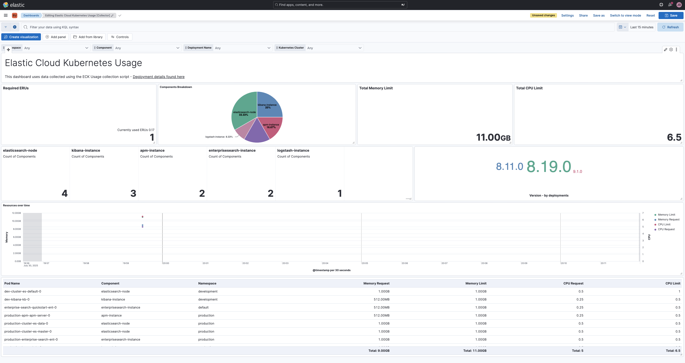
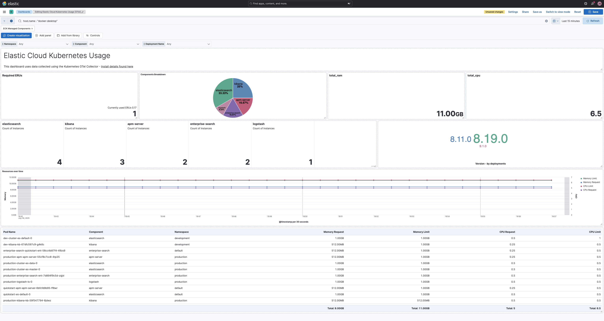

# ECK Usage Dashboard

Monitor and analyze Elastic Cloud on Kubernetes (ECK) resource usage with comprehensive metrics collection and visualization dashboards.

## 🎯 Overview

This project provides two methods to collect and monitor ECK resource usage:

1. **Python Script Collector** - Custom Python script with granular per-instance metrics
2. **OpenTelemetry Collector** - Cloud-native approach using Kubernetes OpenTelemetry collector

Both methods generate **ECS-compliant documents** with individual metrics for each component instance (pods), providing detailed visibility into resource consumption across your ECK deployments.

## 📊 Dashboards

Two pre-built Kibana dashboards are available in the `dashboards/` directory:

## 🏗️ Architecture

### Data storage

Both collection techniques use Elasticsearch to store the monitoring data so you therefore need an Elastic cluster where you wish to send such data.

### What Gets Monitored

- **Elasticsearch** - Individual nodes per nodeset (master, data, ingest, etc.)
- **Kibana** - Individual instances with resource allocation
- **APM Server** - Per-instance metrics and configuration
- **Enterprise Search** - Instance-level resource tracking
- **Logstash** - Individual pipeline instances
- **Elastic Agent** - Agent instances (Deployment/DaemonSet modes)

### Key Metrics Collected

- **Resource Allocation**: CPU/Memory requests and limits per pod
- **Health Status**: Component health and availability
- **Configuration**: Node roles, references, and deployment settings
- **Instance Details**: Pod names, service names, and workload mapping
- **Licensing**: ECK operator licensing information

## 🚀 Method 1: Python Script Collector

### Python Script Collector Dashboard



### Requirements

- This script needs to be ran on a host with `kubectl` installed and configured for the Kubernetes cluster where ECK is running. Step 3 checks kubeclt has the required permissions.

### Installation

1. **Clone the repository:**

   ```bash
   git clone https://github.com/jamesagarside/eck-usage-dashboard
   cd eck-usage-monitoring
   ```

2. **Install dependencies:**

   ```bash
   pip install -r requirements.txt
   ```

3. **Ensure kubectl access:**
   ```bash
   kubectl auth can-i get es --all-namespaces
   kubectl auth can-i get kb --all-namespaces
   kubectl auth can-i get apm --all-namespaces
   kubectl auth can-i get ent --all-namespaces
   kubectl auth can-i get ls --all-namespaces
   kubectl auth can-i get agent --all-namespaces
   ```

### Configuration

1. **Copy the example configuration:**

   ```bash
   cp config.env.example config.env
   ```

2. **Edit `config.env` with your settings:**
   ```bash
   ELASTICSEARCH_URL=https://your-cluster.elastic-cloud.com:9243
   ELASTICSEARCH_API_KEY=your_api_key_here
   INDEX_PREFIX=eck-usage
   ```

### Usage

#### Basic Usage

```bash
python eck_usage_monitor.py \
  --elasticsearch-url https://your-cluster.com:9200 \
  --api-key your_api_key_here
```

#### Advanced Usage

```bash
# Custom index prefix
python eck_usage_monitor.py \
  --elasticsearch-url https://your-cluster.com:9200 \
  --api-key your_api_key_here \
  --index-prefix my-eck-metrics

# Specific namespace monitoring
python eck_usage_monitor.py \
  --elasticsearch-url https://your-cluster.com:9200 \
  --api-key your_api_key_here \
  --namespace elastic-system

# Enable debug logging
python eck_usage_monitor.py \
  --elasticsearch-url https://your-cluster.com:9200 \
  --api-key your_api_key_here \
  --debug
```

#### Environment Variables

```bash
export ELASTICSEARCH_URL=https://your-cluster.com:9200
export ELASTICSEARCH_API_KEY=your_api_key_here
python eck_usage_monitor.py
```

#### Scheduling with Cron

```bash
# Add to crontab for hourly collection
* * * * * /usr/bin/python3 /path/to/eck_usage_monitor.py --config /path/to/config.env
```

### Data Structure

The Python collector creates **individual documents per component instance**:

#### Example: Elasticsearch Cluster

- **Deployment**: `production-cluster` with 3 master + 6 data nodes
- **Result**: 9 individual documents (one per Elasticsearch pod)
- **Service Names**: `production-cluster-es-master`, `production-cluster-es-data`
- **Pod Names**: `production-cluster-es-master-0`, `production-cluster-es-data-3`

## 🔧 Method 2: OpenTelemetry Collector

### OpenTelemetry Collector Dashboard



### Overview

Use the Kubernetes OpenTelemetry Collector to collect resource information from within your Kubernetes cluster. By default this method collects metrics and logs from ALL pods in ALL namespaces. If you have a sizable Kubernetes cluster you should consider scoping your OTel Collectors access or use Method 1 of this guide.

### Prerequisites

- OpenTelemetry Collector deployed in your Kubernetes cluster
- Proper RBAC permissions for cluster resource access
- Elastic Agent or direct Elasticsearch output configured

### Configuration

The following steps can be found within your Elastic cluster by going to '\<your deployment url\>/app/observabilityOnboarding/otel-kubernetes/?category=kubernetes'

#### 1. Add OpenTelemetry Collector Helm Repo

```bash
helm repo add open-telemetry 'https://open-telemetry.github.io/opentelemetry-helm-charts' --force-update
```

#### 2. Deploy OTel Collector

```bash
kubectl create namespace opentelemetry-operator-system
kubectl create secret generic elastic-secret-otel \
  --namespace opentelemetry-operator-system \
  --from-literal=elastic_endpoint='<elastic_endpoint URL>' \
  --from-literal=elastic_api_key='<api_key>'
helm upgrade --install opentelemetry-kube-stack open-telemetry/opentelemetry-kube-stack \
  --namespace opentelemetry-operator-system \
  --values 'https://raw.githubusercontent.com/elastic/elastic-agent/refs/tags/v9.1.0/deploy/helm/edot-collector/kube-stack/values.yaml' \
  --version '0.3.9'
```

## 📈 Dashboard Installation

### Import Dashboards

For the most up to date steps on how to import dahboards please view [this documentation page](https://www.elastic.co/docs/explore-analyze/dashboards/import-dashboards)

## ECS Fields Structure

```json
{
  "@timestamp": "2025-07-30T10:30:00.000Z",
  "ecs": { "version": "8.0.0" },
  "event": {
    "kind": "metric",
    "category": ["host"],
    "type": ["info"],
    "dataset": "eck.usage"
  },
  "orchestrator": {
    "type": "kubernetes",
    "namespace": "elastic-system",
    "resource": {
      "name": "production-cluster",
      "type": "elasticsearch"
    }
  },
  "service": {
    "name": "production-cluster-es-master",
    "type": "elasticsearch",
    "version": "8.8.0"
  },
  "eck": {
    "component": {
      "type": "elasticsearch-node",
      "pod_name": "production-cluster-es-master-0",
      "roles": ["master"],
      "nodeset_name": "master"
    }
  },
  "metrics": {
    "memory": {
      "request_bytes": 2147483648,
      "limit_bytes": 2147483648
    },
    "cpu": {
      "request_cores": 1.0,
      "limit_cores": 1.0
    }
  }
}
```

For detailed ECS field mappings and data structures, see [docs/ECS_STRUCTURE.md](docs/ECS_STRUCTURE.md).

## 🧪 Development & Testing

### Test Environment

Deploy test ECK resources:

```bash
kubectl apply -f dev/eck-test-clusters.yaml
```

### Running Tests

```bash
# Test script functionality
python -m pytest tests/

# Test OpenTelemetry configuration
kubectl logs -n opentelemetry-operator-system deployment/eck-usage-collector
```

### Debugging

Enable debug logging:

```bash
python eck_usage_monitor.py --debug --dry-run
```

## 📋 Requirements

### Python Script Collector

- Python 3.7+
- kubectl configured for cluster access
- Required packages: `requests`, `urllib3`

### OpenTelemetry Collector

- Kubernetes cluster with ECK deployed
- OpenTelemetry Operator installed
- Sufficient RBAC permissions

## 🤝 Contributing

1. Fork the repository
2. Create a feature branch
3. Make your changes
4. Add tests if applicable
5. Submit a pull request

## 🆘 Support

- **Issues**: GitHub Issues for bug reports and feature requests
- **Documentation**: Additional docs in the `docs/` directory
- **Examples**: Sample configurations in `dev/` directory

---

**Happy Monitoring!** 🚀
